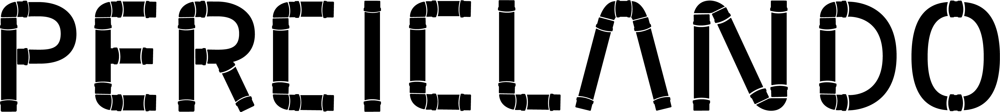

  
  <h1>Perciclando - Design System</h1>

  

  

  

  

  

  

  

## 📝 License

This project is under license from MIT. For more details, see the [LICENSE](LICENSE.md) file.

Made with ❤️ by <a href="https://github.com/Quinhas" target="_blank">Lucas Santana</a>

---
